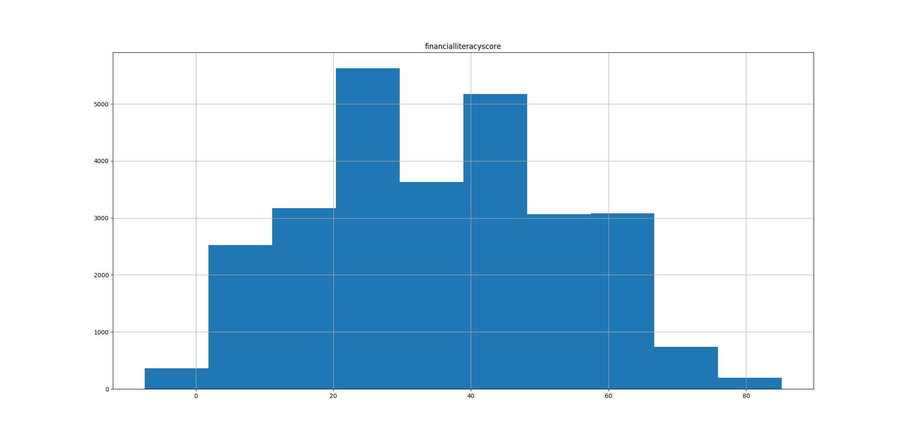
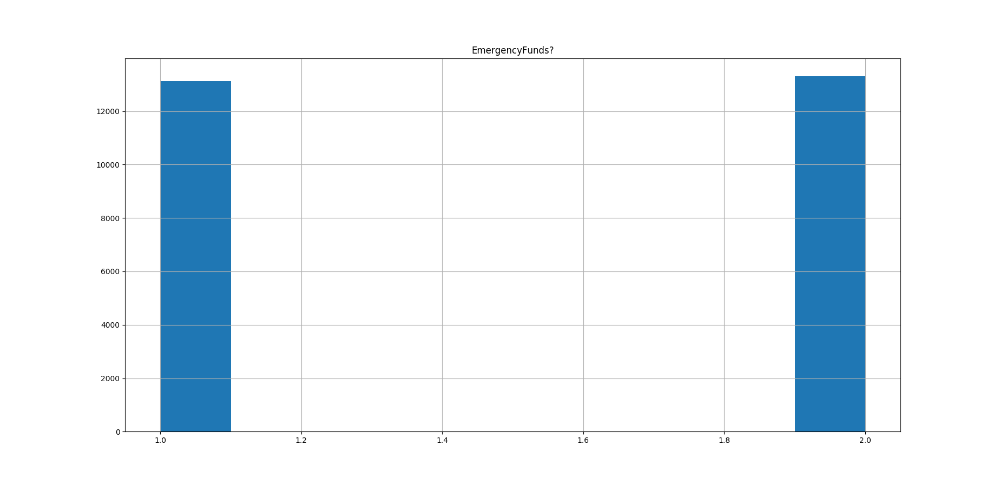

Whether you work extensively with data or not, I just know that you have data on your mind.  Whether you're in marketing, HR, sales, design, _whatever!_, knowing the relevant stats about your team will give you a basis of where your work stands, in terms of knowing your competition, making sound decisions, or creating precise trajectories about the future. Really, this list can go on; my point is, data will always serve as a tool at work, and it can do wonders if you know how to work with it mindfully and intelligently.   

Now, the big caveat here is that data can get big, messy, and abstract.  Data science is booming right now just due to this fact.  But what happens when a data scientist produces statistical models that are too complex to understand merely by the nature of the data? Models can have multiple layers with multiple parameters, so you can imagine how hard it can get when presenting in front of important figures, notably the company's stake holders.

A challenge that many data scientists face is this: how do I convey the data in a way that really sticks with the audience? For one thing, you must _know_ your audience.  What does your audience want? What do they want to hear, and do you have what they want? If you don't, what can you do to make this as close of a reality as possible? 

For another thing, you must _work smart, not necessarily hard_.  Don't present complex statistical concepts with the means of showing off your number skills.  _Do not ever enter a meeting room with that mindset_. What you have to do is keep it simple, but nontrivial.  Extract the most fundamental components from your analysis.  Focus on those implications that specifically pertain to your audience members.  Present visualizations that are easy to read, like histograms and box plots.  

As you can take away from this, the role of a data scientist requires the ability to depict an accurate picture in the most effective means possible.  Story-telling is a skill crucial to any data scientist, and I believe it is something that will stay prevalent in the industry.

So what's my story?! Let's turn back to the original problem, that is: Financial Literacy is a topic that is heavily underserved in our education system today.

## First:  Surveyees do have the sufficient knowledge and skills needed to effectively manage their finances.
=======
```python
def score_analysis(df):
	df.hist(column = 'financialliteracyscore')
	print(df['financialliteracyscore'].describe())
	print('98th percentile = ' + str(df['financialliteracyscore'].quantile(q=.98)))
	plt.show()
```



``` 
count    27564.000000
mean        43.777176
std         18.175437
min          0.000000
25%         29.629630
50%         44.444444
75%         59.259259
max         92.592593

98th percentile = 77.77777777777779
```

### Three-quarters of the sample scored an F average on the financial literacy test (59.3%).  Only 9% of the sample passed the test with at least a 70%.


```python
def emergency_funds(df):
	er_funds = df.loc[df['EmergencyFunds?'].isin([1,2])] #only want 1=yes and 2=No values
	er_funds.hist(column = 'EmergencyFunds?')
	er_funds['EmergencyFunds?'].describe()
	plt.show()
```


```
mean         1.503745
```

### A shocking 1:1 split between people who have set aside an emergency fund and those who have not.


