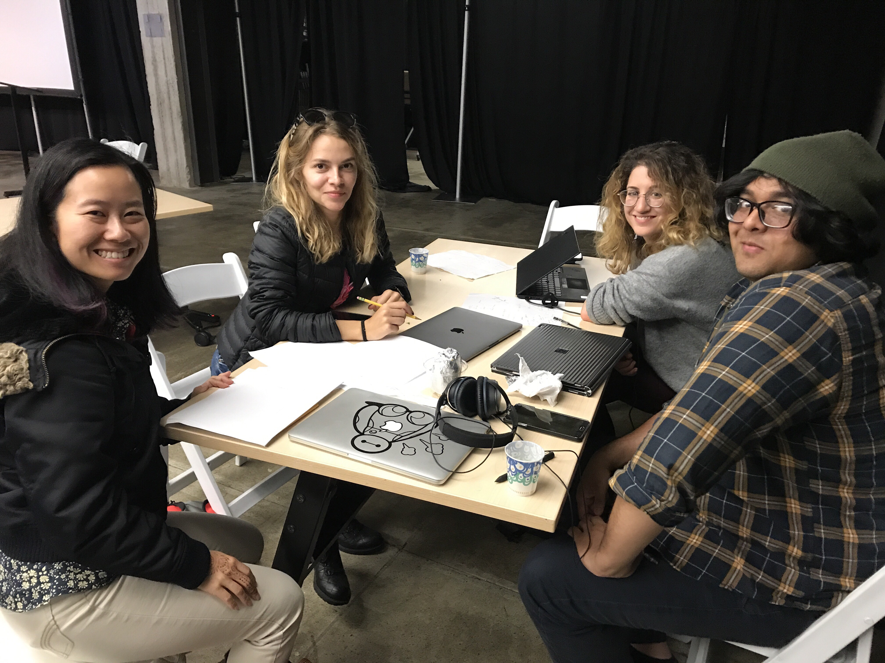

My latest learning experience came from a hackathon I attended last weekend. It was technically a 'datathon', as the sponsors had coined it, and the topic was genetics.  As data has become more accessible than ever (you can literally send your _saliva_ to a lab and the lab will then send back some freakishly intimate information about yourself), companies are more in need of programmers who can genereate interesting things out of the data. 

I'm not here to provide the microdetails of the experience, but rather the greatest takeaways from it.  

1. It's really important to enter a hackathon with specific goals in mind. 

Hackathons can feel really intimating for beginners.  It may feel tempting to quit and leave, but I urge you to _never do that_. If you quit, then that means you didn't set high goals for yourself.  If you enter a hackathon with measurable goals in mind, making at least three pull requests each night, for instance, then you will find it less tempting to reject a hackathon.  If you don't have concrete goals, that's okay too, as long as you _some kind_ of goals, whether it be to learn or to meet people.  Hackathons are amazing in the way that they have many avenues to seek out knowledge and expand your network.

2.  Your portfolio and github automatically look better after participating in a hackathon.

You may find yourself spending a few weeks on a personal project that you'd love to show off on github or your portfolio.  But once you go through a weekend of hacking with a team, you get to share these accomplishments, and hence making your portfolio rich with real-world experience.

3. This is actual real-world stuff! The work that is produced by an effective hacking team can potentially make an impact.

This point isn't emphasized enough in the community of beginners.  You never know what kind of amazing work that can be done with a team of developers, data scientists, and designers.  Furthermore, if you're determined to win, there is a chance that the sponsoring company uses your code, which would be ultimate prize.  

4. You will encounter uncomfortable moments with your team.

If you think about it, as you're brainstorming or hacking all hours in the night with your team, a team in which not everyone knows each other very well, there's a high chance you will encounter some uncomfortable moments with your fellow hackers.  Maybe someone doesn't like the idea? Maybe another feels left out?  Maybe there's a disagreement about code? These types of incidents, no matter how hard we try to avoid them, are inevitable and will happen in real life.  So, you will be fortunate to experience this discomfort at a hackathon, where things are super temporary, as you will get to learn ways to respond to awkward and displeasing moments with your team.


5. You will learn SO MUCH.

I can't say this enough. The things I learned at this hackathon are things that I wouldn't be able to get so nicely and quickly through a tutorial.  The human approach to learning, especially when it's project based, is the most effective way to retain information; as a former educator, trust me, it's true!

Just to share what I learned, here's just a few:
+ how to use a business's API for my own use using Python
+ what dimensionality reduction and kmeans applications look like in R
+ amazing Linux terminal commands that are really effective when filtering data, like ```grep```, ```cut```, ```tr```, ```sort```, ```unique```
+ making visual networks on R


So get yourself out there and learn. Ask questions, be humble, and be a positive team member.  Your participation and experience will be valued, I promise. It's a win-win!


