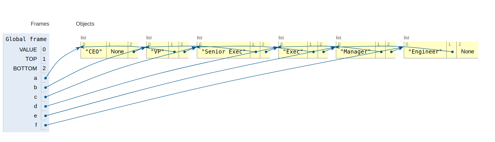

## TakeAway 1: Visualizing the Data Structure

Raymond showed us [Visualize Python](http://www.pythontutor.com/visualize.html#mode=edit), a unique website that uncovers the true nature of objects in Python.  

This website is gnarly!  It enlightens a few points:
1.  Lists just point to stuff
2.  A list can point to anything, including other lists
3. Lists are objects that have useful functionality, like indexing, that really leverage its identity as an object

For instance, suppose you had this following 'skeleton' of a list that intends to describe the hierarchical structure of a corporation:


```python
TITLE_NAME, TOP, BOTTOM = 0, 1, 2
```

This means that the 0th index will be the actual name of the title. The first index will return a subset (a list) of the hierarchy above this index, and the bottom index will return a subset (a list) of the hierarchy below this index. 

The CEO will have no one on top of him.  


```python
first = ['CEO', None, None]
second = first[BOTTOM]=['VP', first, None]
```


```python
print(first[TOP])
```

    None


That makes sense because no one is on top of the CEO


```python
print(first[BOTTOM][TITLE_NAME])
```

    VP


See how indexing can leverage the notion of a list being an object?


```python
third = second[BOTTOM] = ['Senior Exec', second, None]
fourth = third[BOTTOM] = ['Exec', third, None]
fifth = fourth[BOTTOM] = ['Manager', fourth, None]
```


```python
third[TOP][TOP][TITLE_NAME]
```


    'CEO'


The skeleton of our list also allowed us to write code that is intuitive and logical. For example, the above code returns the object that is two levels above the third object, which in this case, is the CEO

If you copy and paste a code like this on the website, you get an image that resembles this:


The visualization here sheds light on the true nature of lists -- they're just objects that point to other objects, in this case, either strings or lists.


____________________________________________________________________

## TakeAway2: Elegant construction of Binary Tree

With the same logic, we can construct a binary tree that depicts domestic relationships and hierarchies.


```python
NAME, MAMA, BABA = 0, 1, 2 

def person(name,mama=None,baba=None):  #by default, mama and baba point to None
    return [name, mama, baba]

elize = person('Elize')
hagop = person('Hagop')

hripsime = person('Hripsime')
garabed = person('Garabed')

levon = person('Levon', elize, hagop)
silva = person('Silva', hripsime, garabed)

elizabeth = person('Elizabeth', silva, levon)

```


```python
print('Grandfathers: ')
print('|- (maternal)', elizabeth[MAMA][BABA][NAME])
print('|- (paternal)', elizabeth[BABA][BABA][NAME])
```

    Grandfathers: 
    |- (maternal) Garabed
    |- (paternal) Hagop


```python
print('Grandmothers: ')
print('|- (maternal)', elizabeth[MAMA][MAMA][NAME])
print('|- (paternal)', elizabeth[BABA][MAMA][NAME])
```

    Grandmothers: 
    |- (maternal) Hripsime
    |- (paternal) Elize


I love how elegant the function ```person``` looks. The code kind of looks like English!  One who doesn't know code really well or none at all would be able to understand what that function does.


Since Raymond already went over pre-order and in-order, I will provide the code for postorder.


```python
def postorder(p):
    if p is None:
        return []
    return postorder(p[MAMA]) + postorder(p[BABA]) + [p[NAME]]
```


```python
postorder(elizabeth)
```


    ['Hripsime', 'Garabed', 'Silva', 'Elize', 'Hagop', 'Levon', 'Elizabeth']


```python
postorder(silva)
elizabeth
```


    ['Elizabeth',
     ['Silva', ['Hripsime', None, None], ['Garabed', None, None]],
     ['Levon', ['Elize', None, None], ['Hagop', None, None]]]


______________________________________________________

## TakeAway3: easy to read data != reliable data

* In case you do encounter data that looks like it's meant for humans to read it, convert it into a structure that would make it easier for a computer to read it.  
* Sniffer tool in csv library can detect the separator in the data -- super cool!!
* XML's terminology comes in hand when implementing XML parsers
